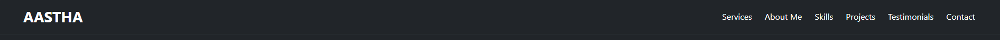
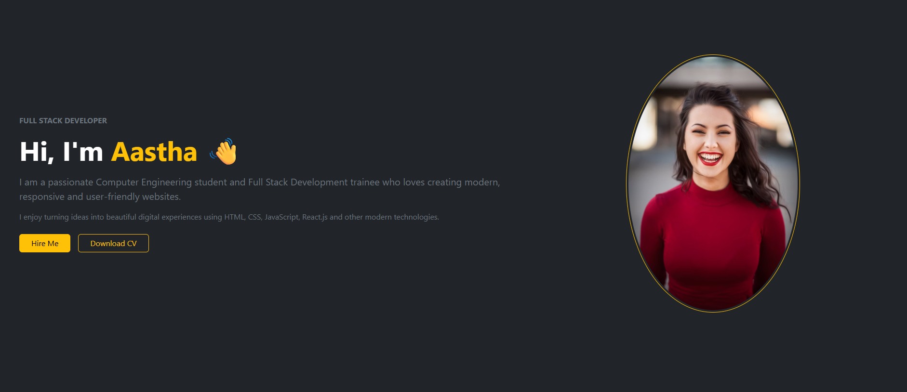
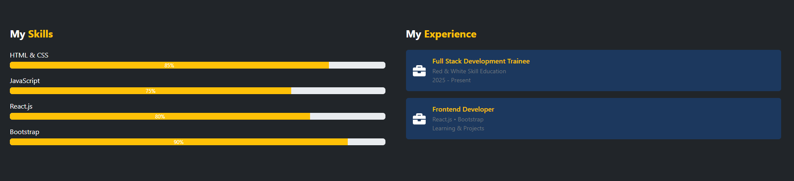
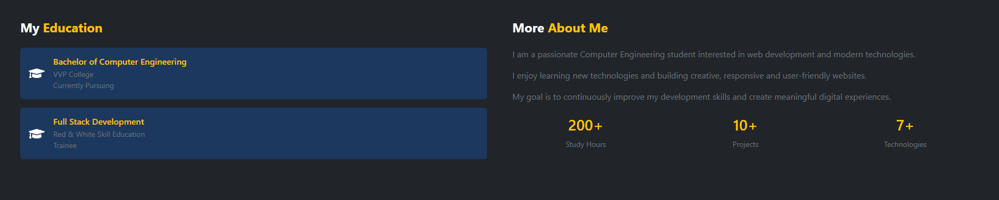
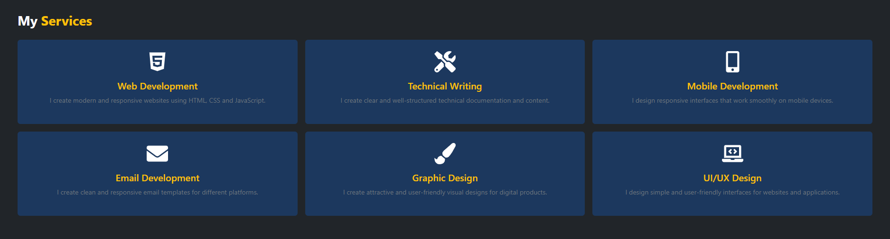
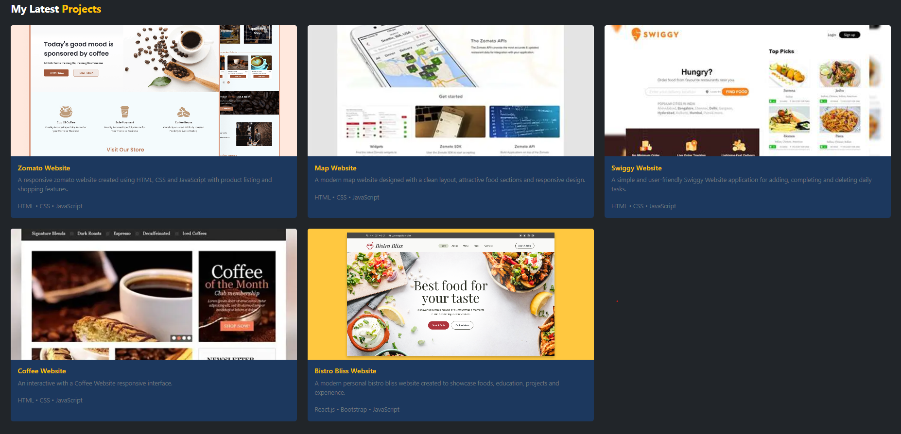
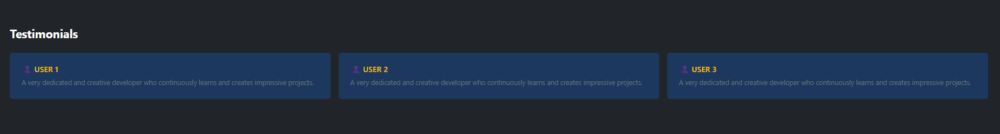
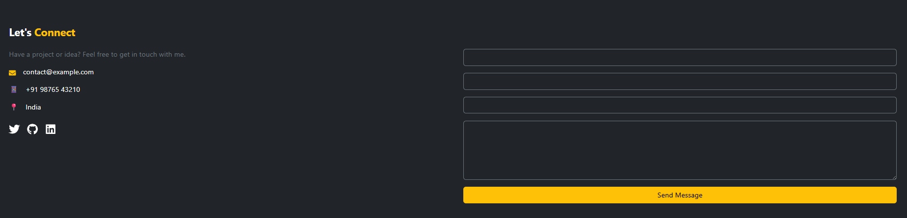
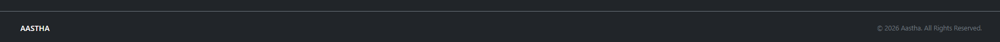

<div align="center">

# ✨ Personal Portfolio Website

### A Modern and Responsive Single-Page Portfolio Built with React.js

**Home • About • Skills • Education • Experience • Services • Projects • Testimonials • Contact**

<br>


</div>

---

## 📌 About The Project

This is a **Personal Portfolio Website** created using **React.js, Bootstrap and CSS**.

The website presents my personal, educational and professional information in a clean and attractive single-page layout.

It includes different sections such as:

- 👤 About Me
- 💻 Skills
- 🎓 Education
- 💼 Experience
- 🛠️ Services
- 🎨 Projects
- 💬 Testimonials
- 📩 Contact
- 👣 Footer

The website is designed using **responsive Bootstrap classes** and custom CSS so that it works properly on different screen sizes.

---

# 👀 Preview

## 🎥 Website Video

The complete website walkthrough video is available on Google Drive.

> 🔗 **Portfolio Video:**  
> https://drive.google.com/file/d/1C479PBSvlvUgn_8AytekWOky8Go8yMo4/view?usp=sharing

The video demonstrates the complete portfolio website and its different sections.

---

# 📸 Website Screenshots

## 🧭 Header / Navigation

The Header section contains the portfolio navigation menu and provides easy access to different sections of the website.



---

## 🏠 Home / Hero

The Home section introduces me as a **Full Stack Developer**.

It contains the main introduction, profile information, buttons and hero content.



---

## 👤 About Me

The About section provides information about me, my interests and my journey in Computer Engineering and Web Development.

It also contains portfolio statistics and other personal information.



---

## 💻 Skills

The Skills section displays my technical knowledge using progress bars.

### Skills Included

| Technology | Level |
|---|---:|
| HTML & CSS | 85% |
| JavaScript | 75% |
| React.js | 80% |
| Bootstrap | 90% |


---

## 🎓 Education

The Education section presents my academic and professional learning information.

### Bachelor of Computer Engineering

**V.V.P. Engineering College**

`Currently Pursuing`

### Full Stack Development

**Red & White Skill Education**

`Trainee`



---

## 💼 Experience

The Experience section presents my development training and frontend learning experience.

### Full Stack Development Trainee

**Red & White Skill Education**

`2025 - Present`

Learning and practicing Full Stack Development technologies.

### Frontend Development

**React.js • Bootstrap**

Learning and creating frontend projects using React.js and Bootstrap.

---

## 🛠️ Services

The Services section displays the different services provided through attractive cards.

### Available Services

- 🌐 Web Development
- 📝 Technical Writing
- 📱 Mobile Development
- 📧 Email Development
- 🎨 Graphic Design
- 🖥️ UI/UX Design



---

# 🎨 Projects

The Projects section showcases five practical website projects.

## 🍴 Zomato Website

A food delivery website interface inspired by modern restaurant and food ordering platforms.

---

## 🗺️ Map Website

A map-based website interface created around location and navigation-related content.

---

## 🍔 Swiggy Website

A food ordering website interface inspired by popular food delivery platforms.

---

## ☕ Coffee Website

A coffee-themed website created with a clean and attractive design.

---

## 🍽️ Bistro Bliss Website

A restaurant website designed with a modern and elegant interface.



---

## 💬 Testimonials

The Testimonials section displays feedback from different users.

The portfolio contains **three testimonial cards**, each showing user information and feedback.



---

## 📩 Contact

The Contact section allows visitors to get in touch with me.

It contains contact information and a contact form for communication.



---

## 👣 Footer

The Footer is the final section of the portfolio.

It contains additional portfolio information and navigation details.



---

# 🌟 Features

| ✨ | Feature |
|---|---|
| ⚛️ | React.js based website |
| 📱 | Responsive design |
| 🎨 | Bootstrap + Custom CSS |
| 🧩 | Single-page layout |
| 🖼️ | Image-based portfolio sections |
| 💫 | Custom styling and hover effects |
| 🔗 | Section-based navigation |
| 💬 | Testimonials section |
| 📸 | Website screenshots |
| 🎥 | Complete website video |

---

# 🛠️ Technologies Used

- **React.js**
- **JavaScript**
- **Bootstrap**
- **CSS3**
- **HTML5 / JSX**
- **React Icons**

---

# 📂 Project Structure

```text
Portfolio_ReactJS
│
├── Portfolio_WebPage/
│   │
│   ├── public/
│   │
│   ├── src/
│   │   │
│   │   ├── Components/
│   │   │   ├── Header.jsx
│   │   │   ├── Testimonials.jsx
│   │   │   └── ...
│   │   │
│   │   ├── screenshots/
│   │   │   ├── about-skills.png
│   │   │   ├── contact.png
│   │   │   ├── education.png
│   │   │   ├── footer.png
│   │   │   ├── header.png
│   │   │   ├── home.png
│   │   │   ├── projects.png
│   │   │   ├── services.png
│   │   │   └── testimonials.png
│   │   │
│   │   ├── App.jsx
│   │   ├── index.css
│   │   └── main.jsx
│   │
│   ├── package.json
│   ├── package-lock.json
│   └── vite.config.js
│
└── README.md


